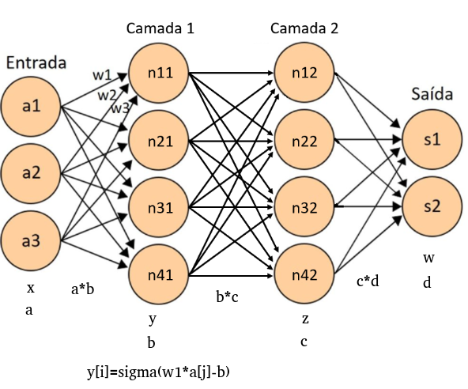
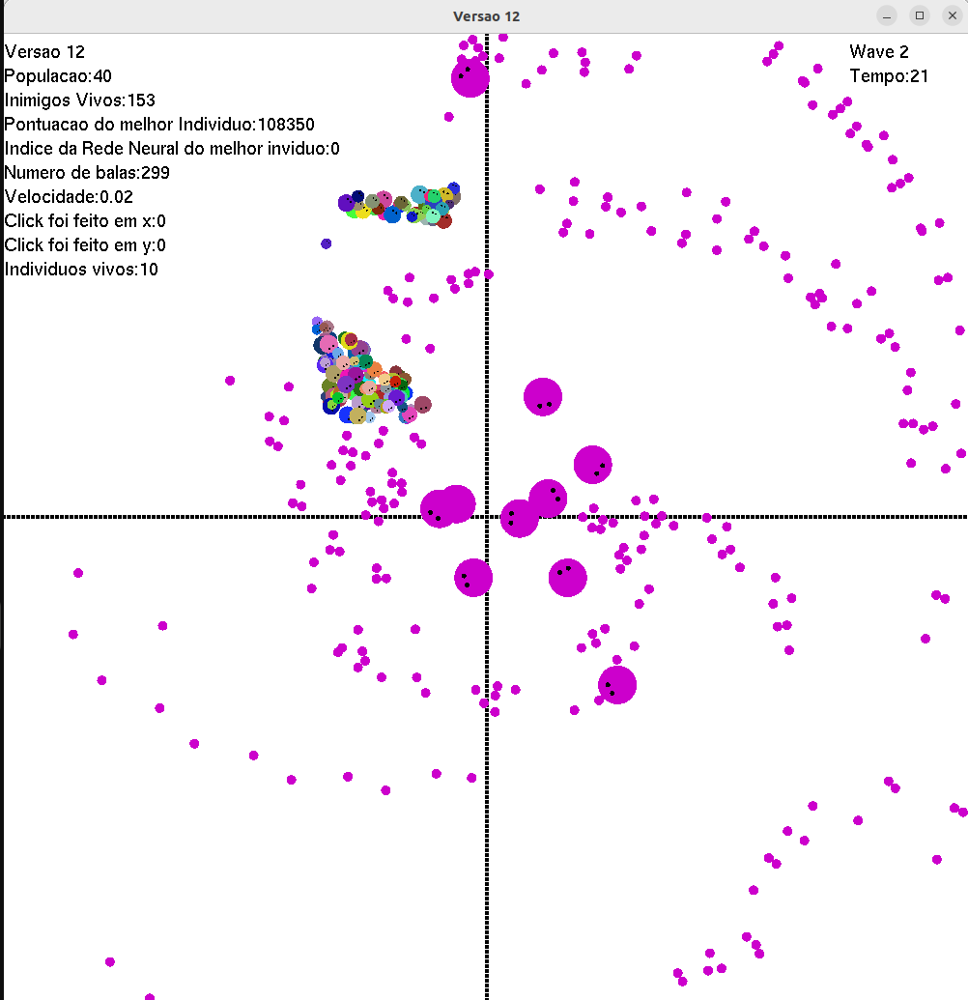

# Algoritmos Evolutivos

## Autores

- Rafael Cunha Bejes Learth - 13676367
- Matheus Pereira Dias - 11207752
- Gabriela Passos de Andrade - 12625142
- Bárbara Fernandes Madera - 11915032

## Link Vídeo
[Vídeo]()

## Descrição do Projeto
<p align="center">
  
  
</p>

[Apresentação](https://www.canva.com/design/DAF3jLBKRBw/SKJhPLyK9EKxtpaHolTpVw/edit)
## Build

### Instalação:
```
$ sudo apt-get install mesa-common-dev
$ sudo apt-get install freeglut3-dev
```
Execução:
```
make run
```
