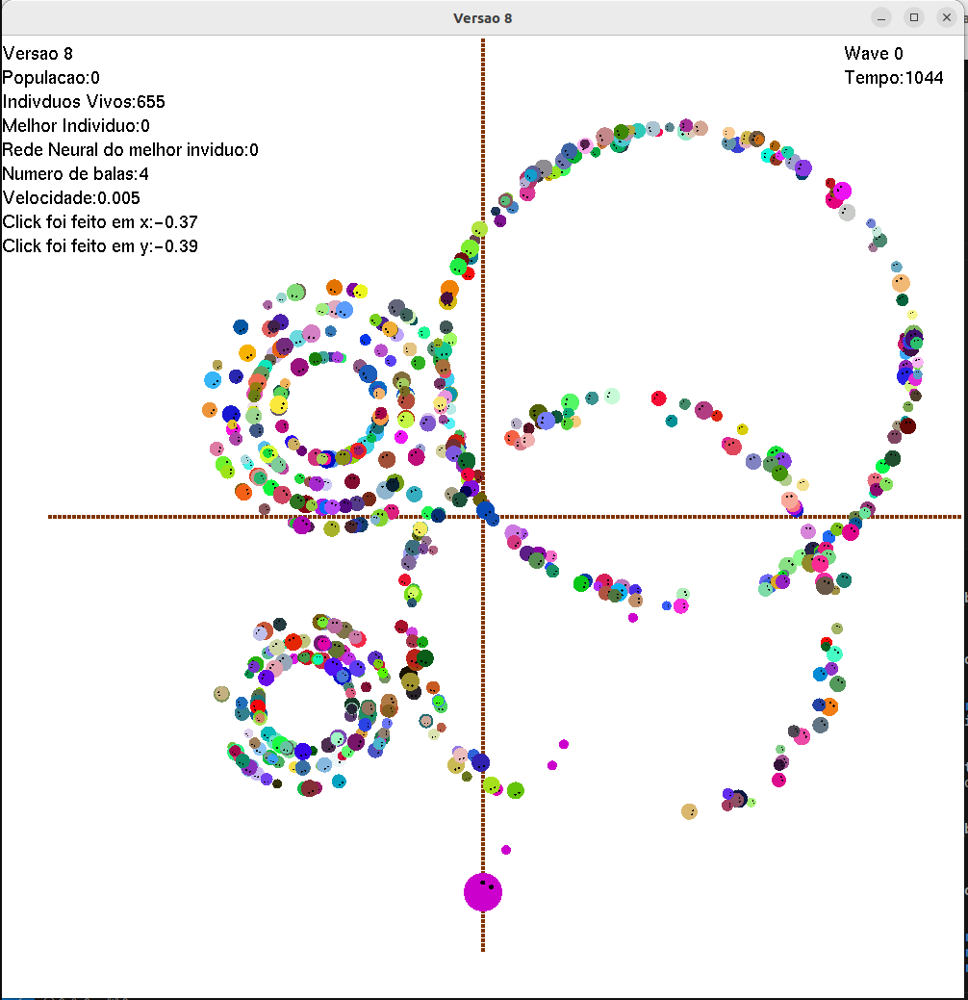

# Algoritmos_Evolutivos

Projeto realizado em linguagem C++ com interface em OpenGL
No Github tem a versão 8 que funciona totalmente, é a interface do projeto com a descrição que se encontra em EsquemaCodigoEvolutivo
a versão 9 é a aplicação da Rede Neural que ainda está em criação

Versão 8:

